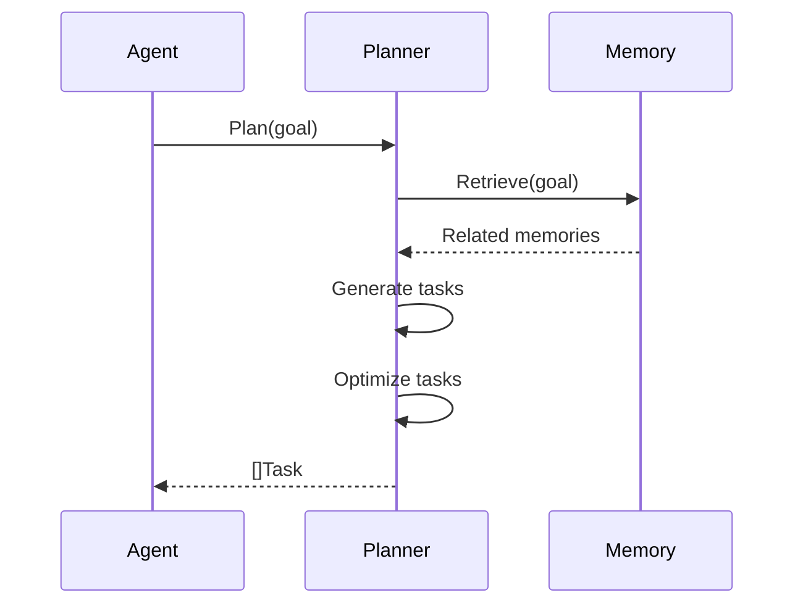

# Agentic AI 详细设计文档

## 1. Agent核心设计

### Agent接口定义
```go
// Agent接口定义核心能力
type Agent interface {
    ID() string
    Name() string
    Capabilities() []string
    Plan(goal string) ([]Task, error)
    Execute(task Task) (Result, error)
    Learn(experience Experience) error
    Communicate(message Message) (Response, error)
}
```

### 基础Agent实现
```go
type BaseAgent struct {
    id           string
    name         string
    capabilities []string
    planner      Planner
    executor     Executor
    memory       Memory
    monitor      Monitor
}

func (a *BaseAgent) Plan(goal string) ([]Task, error) {
    // 1. 检查长期记忆
    related := a.memory.Retrieve(goal)
    
    // 2. 调用Planner生成任务
    tasks := a.planner.Plan(goal, related)
    
    // 3. 优先级排序
    return a.planner.Prioritize(tasks), nil
}
```

## 2. Agent与Flow系统集成

### AgentFlow设计
```go
type AgentFlow struct {
    flow.Flow
    agent Agent
}

// 重写Run方法集成Agent能力
func (af *AgentFlow) Run(ctx flow.FlowContext) (*flow.FlowContext, error) {
    // 1. 将FlowContext转换为AgentContext
    agentCtx := convertToAgentContext(ctx)
    
    // 2. 调用Agent执行
    result := af.agent.Execute(agentCtx.CurrentTask)
    
    // 3. 转换回FlowContext
    return convertToFlowContext(result), nil
}
```

## 3. Planner详细设计

### 任务规划流程


### Planner核心方法
```go
func (p *Planner) Plan(goal string, memories []MemoryItem) []Task {
    // 1. 准备LLM提示
    prompt := buildPlanningPrompt(goal, memories)
    
    // 2. 调用LLM生成任务
    resp := p.llmClient.Chat(prompt)
    
    // 3. 解析响应为任务列表
    return parseTasks(resp)
}
```

## 4. Memory系统设计

### 记忆存储结构
```go
type MemoryItem struct {
    Key       string
    Value     interface{}
    Embedding []float32
    Timestamp time.Time
    Metadata  map[string]string
}

type Memory interface {
    Store(item MemoryItem) error
    Retrieve(query string, limit int) ([]MemoryItem, error)
    Forget(key string) error
}
```

### 短期记忆实现
```go
type ShortTermMemory struct {
    data map[string]MemoryItem
    lock sync.RWMutex
}

func (m *ShortTermMemory) Store(item MemoryItem) error {
    m.lock.Lock()
    defer m.lock.Unlock()
    m.data[item.Key] = item
    return nil
}
```

## 5. 组件交互关系

```mermaid
classDiagram
    class Agent {
        +Plan()
        +Execute()
    }
    
    class AgentFlow {
        +Run()
    }
    
    class Planner {
        +Plan()
    }
    
    class Memory {
        +Store()
        +Retrieve()
    }
    
    Agent --> Planner
    Agent --> Memory
    AgentFlow --> Agent
    Planner --> Memory